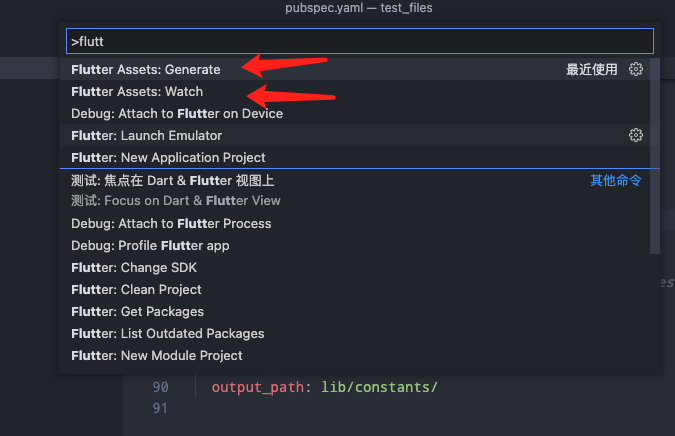

## 命令 (Provide commands)
- F1 > Search flutter assets
  - `Flutter Assets: Watch`
  - `Flutter Assets: Stop Watch`
  - `Flutter Assets: Generate`
  


## 如何使用 (How to use)


- step 1. 在项目pubspec.yaml下添加：

```yaml
flutter_assets:
  assets_path: assets/
  output_path: lib/constants/
  filename: assets.dart
```

- step 2. 生成文件内容

```dart
class Assets {
  Assets._();
  
  /// Assets for loginLogo
  /// assets/images/login/logo.png
  static const String loginLogo = "assets/images/login/logo.png";

  /// Assets for tabHome
  /// assets/images/tab/home.png
  static const String tabHome = "assets/images/tab/home.png";
}
```

